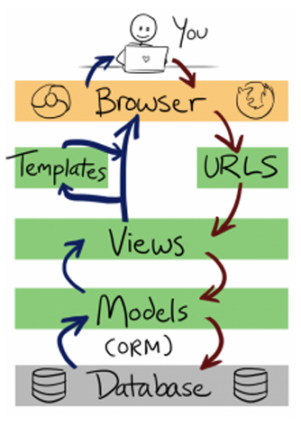

## Histórico de Revisões

|Data|Versão|Descrição|Autor|
| --- | --- | --- | --- |
|28/08/2018|0.1|Criação da estrutura do documento|Ingrid Soares|
|28/08/2018|0.1|Adição de tópicos|Bruno Rodrigues Santos|

# Documento de Arquitetura

Sumário
----------------

* 1 . [Introdução](#1-introdução)
    * 1.1. [Finalidade](#11-finalidade)
    * 1.2. [Escopo](#12-escopo)
    * 1.3. [Definições, acrônimos e abreviações](#13-Definições,-acrônimos-e-abreviações)
    * 1.4. [Referências](#14-referências)
    * 1.5. [Visão Geral](#15-Visão-Geral)
    
* 2 . [Representação da Arquitetura](#2-Representação-da-Arquitetura)
   * 2.1. [Representação do padrão de Arquitetura MVT](#21-Padrão-de-Arquitetura-MVT)
   * 2.2. [Representação da Arquitetura de Microserviços](#22-Arquitetura-de-Microserviços)   
   
* 3 . [Metas e Restrições da Arquitetura](#3-Metas-e-Restrições-da-Arquitetura)

* 4 . [Visão de Casos de Uso](#4-Visão-de-Casos-de-Uso)
   * 4.1. [Atores](#41-atores)
   * 4.2. [Realizações de Casos de Uso](#42-Realizações-de-Casos-de-Uso)

* 5 . [Visão de Processos](5-Visão-de-Procesos)
   
* 6 . [Visão de Implementação](#6-Visão-de-Implementação)
	 * 6.1. [Visão Geral](#61-Visão-Geral)
   * 6.2. [Diagrama de Pacotes](#62-Diagrama-de-Pacotes)
   * 6.3. [Pacotes de Design Significativos do Ponto de Vista da Arquitetura](#63-Pacotes-de-Design-Significativos-do-Ponto-de-Vista-da-Arquitetura)
   
* 7 . [Arquitetura dos Serviços e visão de Implementação](#7-Arquitetura-dos-Serviços-e-visão-de-Implementação)
   * 7.1. [Micro Serviços e Camadas](#71-Micro-Serviços-e-Camadas)

* 8 . [Visão de Dados](#8-visao)
    * 8.1. [Steam Microservice](#81-steam)
    * 8.2. [Twitch Microservice](#81-twitch)

* 9 . [Qualidade](#9-Qualidade)

## 1. Introdução

### 1.1 Finalidade

Este documento mostra uma visão geral sobre a arquitetura e ferramentas utilizadas no projeto GamesBI.

### 1.2 Escopo

Neste documento serão retratados os modelos arquiteturais implementados, descrição e utilização de frameworks 
que compõe o projeto GamesBI, plataforma de business intelligence com temática de jogos digitais. Exploramos 
de maneira detalhada o funcionamento e a visão arquitetural do projeto.

### 1.3 Definições, acrônimos e abreviações

- MVT - Model, View, Template
- MVC - Model, View, Controller

### 1.4 Referências

### 1.5 Visão Geral

O presente documento faz o detalhamento e descrição de características da arquitetura escolhidas pela equipe.
Estaremos descrevento o padrão arquitetural MVT, arquitetura de Microserviços e APIs Rest

## 2. Representação da Arquitetura

A arquitetura do projeto possuirá ambientes diferentes: API's REST, por debaixo do framework MVT Django, assim como o ambiente WEB de interação com usuário. Juntando todos os ambientes e coordenando-os, formamos assim uma arquitetura de Microserviços.

### 2.1 Padrão de Arquitetura MVT

Os padrões de arquitetura expressam formas de organizar a estrura do sistema e ajudam a lidar com a complexidade do software. O padrão utilizado neste projeto é o MVT, que por sua vez se assemelha bastante ao conhecido MVC. Tanto que, de acordo com o Django Book, o Django segue o padrão MVC suficientemente para ser considerado um framework MVC.

* Model
---
As Models do MVC e do MVT são equivalentes em responsabilidades. O framework Django facilita na interface com o banco de dados. Cada classe da modelo se compara a uma tabela do banco de dados, e as instâncias destas classes, representam os registros destas tabelas. Para adicionar valores ao banco, basta definí-los nas respectivas variáveis. Esta camada contém qualquer coisa e tudo sobre os dados: como acessá-lo , como validá-lo , quais comportamentos que tem e as relações entre os dados. Para o mapeamento dos dados, não será necessário utilizar códigos em SQL para garantir a persistência dos dados no banco.

* View 
---
A camada View é responsável pela implementação das regras de apresentação e negócio do nosso sistema. É nela onde iremos nos comunicar com a Model e a Template, cadastrando e tratando as informações recebidas. Retornando para o usuário uma resposta, como HTMLs, XML, ou erros encontrados. Esta é equivalente a Controller na arquitetura MVC

* Template
---
Templates é a camada que retorna a visão para o usuário do programa. Essa camada é composta por, HTML,CSS, javascript e etc. Geralmente linguagens focadas na apresentação do site para o usuário.

* Detalhes arquiteturais
---
As resoluções de urls, responsabilidade dada as controllers no MVC, é feita pela própria estrutura do framework

O Django oferece uma interface com o banco de dados que permite ao desenvolvedor não se preocupar com a conexão entre suas classes de domínio e banco.

### 2.2 Arquitetura de Microserviços

## 3. Metas e Restrições da Arquitetura

A Arquitetura desse projeto tem como principal objetivo o desacoplamento do sistemas em diferentes 
microserviços, trazendo máxima independência possível, favorecendo o entendimento sobre o objetivo de 
cada microserviço, a manutenibilidade e evolução

## 4. Visão de Casos de Uso
### 4.1 Atores
### 4.2 Realizações de Casos de Uso

## 5. Visão de Procesos

## 6. Visão de Implementação
## 6.1 Visão Geral
### 6.2 Diagrama de Pacotes
### 6.3 Pacotes de Design Significativos do Ponto de Vista da Arquitetura

## 7. Arquitetura dos Serviços e visão de Implementação
### 7.1 Micro Serviços e Camadas

## 8 Visão de dados
### 8.1 Microserviço 1: Steam_Data

### 8.2 Microserviço 2: Twitch_Data

## 9. Qualidade
